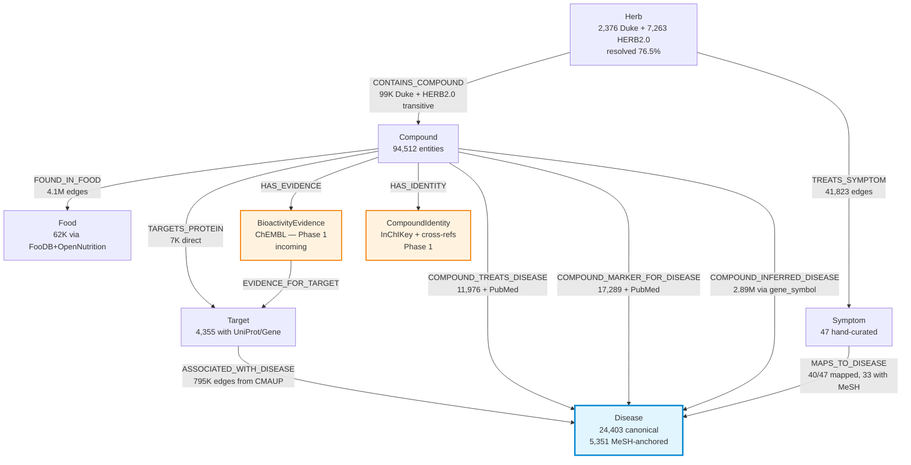
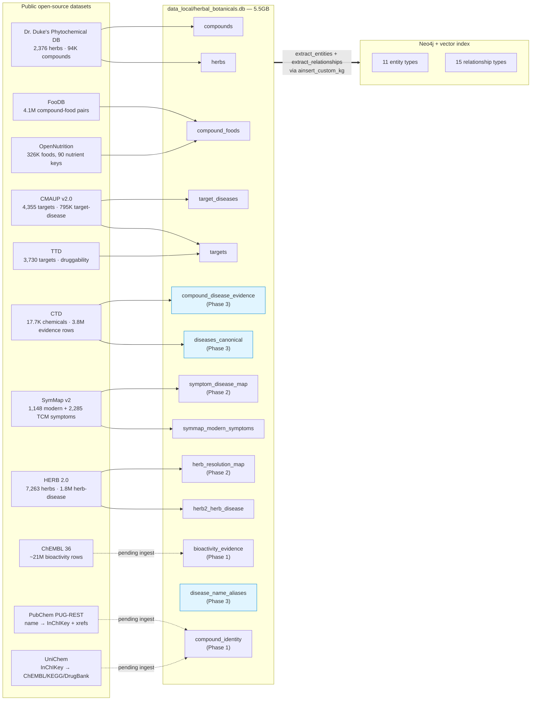
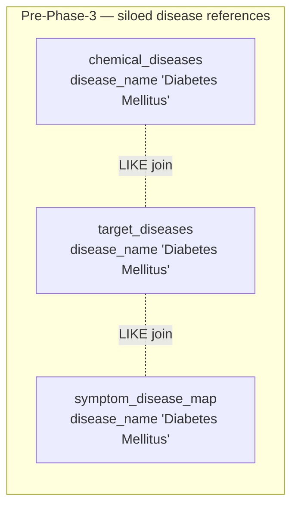
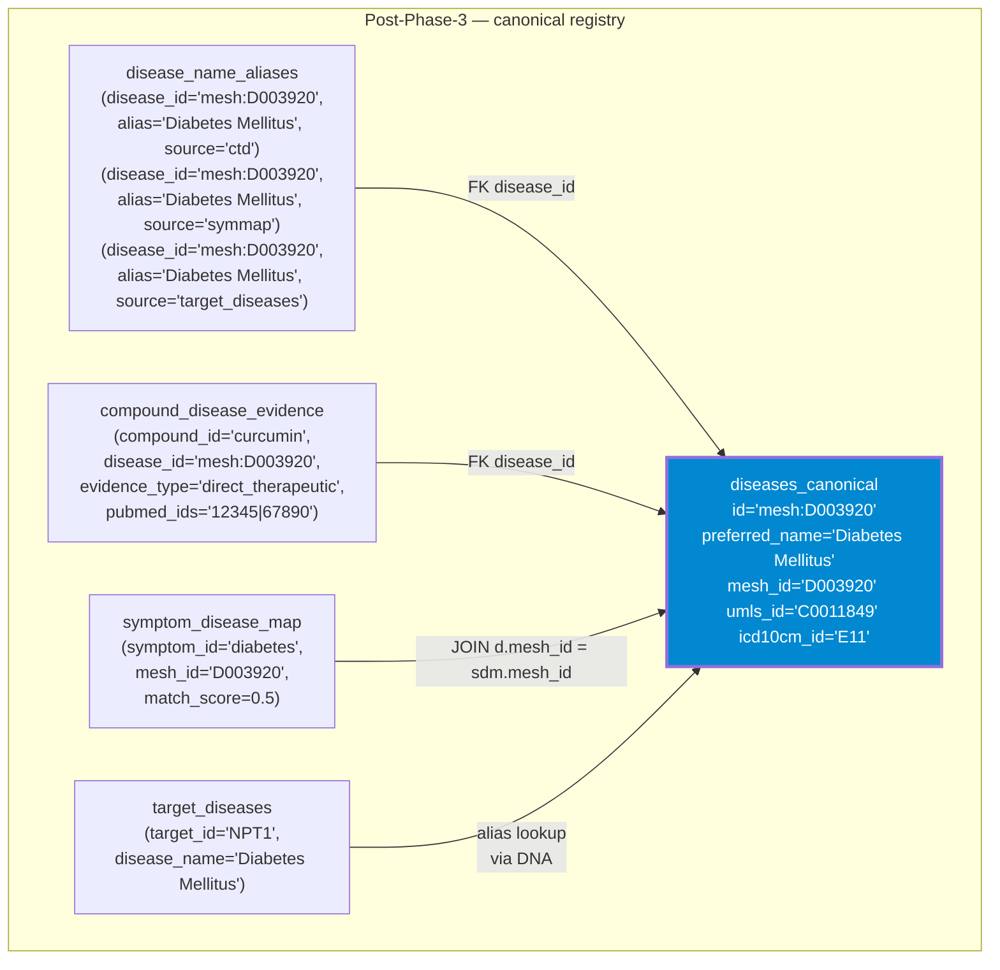
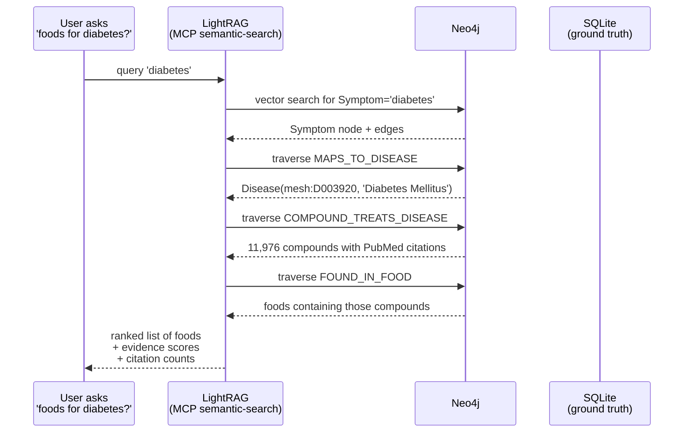
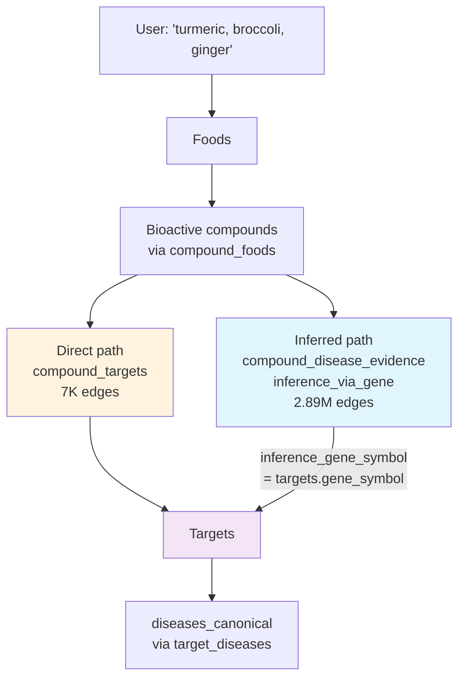
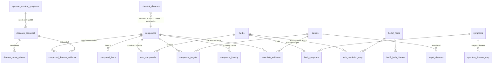

# KG Architecture (post-Phase-3)

> Authoritative architectural reference for the unified diet KG. Updated each phase.
>
> Last refreshed: 2026-05-08 (Phase 3 — disease canonicalization). For per-source
> licensing and refresh cadence see [`DATASET_PROVENANCE.md`](DATASET_PROVENANCE.md).
> For the gap-driven roadmap see [`KG_COMPLETENESS_AUDIT.md`](KG_COMPLETENESS_AUDIT.md).

---

## TL;DR — what this graph encodes

A unified knowledge graph spanning **diet → food → bioactive compound → molecular target → disease/symptom**, evidence-graded by literature citations. Purpose-built for two LLM-agent query patterns:

- **A. Symptom → food** — "what foods may help with X?" — ranked by ontology join + ChEMBL bioactivity + CTD literature
- **D. Diet → effects** — "what physiological effects does this diet predict?" — mechanistic chain through compound → gene → target → disease

A third query pattern (**C. Compound dossier**) falls out for free from the same backbone.

---

## High-level entity graph (Mermaid)



**Caption:** Eleven entity types (8 domain + 3 added in Phases 1–3, highlighted). The Disease node is a *unification point* — five distinct relationship types converge there from different evidence layers (symptom mapping, target association, three flavors of compound evidence). The orange-bordered nodes (`CompoundIdentity`, `BioactivityEvidence`) are scaffolding from Phase 1; their actual ingest runs against the live DB are pending.

---

## Data ingest topology (sources → canonical)



**Caption:** Sources flow into the ground-truth SQLite database (left → middle), which feeds LightRAG via per-entity-type extractors that emit pre-formed graph deltas (`ainsert_custom_kg`, zero LLM cost). Phase 3's three new tables (blue-highlighted) materialize cross-source disease unification. Dotted arrows mark Phase 1 sources whose ingest scripts ship in PR #19 but haven't been run end-to-end yet.

---

## The Disease unification (Phase 3 — what this PR adds)

Before Phase 3, three independent free-text disease columns lived siloed:



After Phase 3:



**Caption:** Every observable disease string in any source resolves to one canonical entity keyed by its strongest formal ID (MeSH > UMLS > ICD-10 > local-slug fallback). Cross-source joins become indexed equality on `diseases_canonical.id` instead of free-text `LIKE` (with all the noise that implied).

### Live-DB outcome of canonicalization

| Metric | Value | Source contribution |
|---|---:|---|
| Canonical disease entities | **24,403** | symmap +1,148, ctd +6,678, target_diseases +2,398, herb2 +14,833 |
| With MeSH ID | 5,351 | symmap + ctd anchored |
| With UMLS ID | 855 | symmap-only |
| Aliases recorded | 29,075 | every observed name |
| Compound→disease evidence rows | **2,922,025** | re-ingested from CTD into typed schema |
| ↳ direct_therapeutic | 11,976 | gold-standard treatment relationships |
| ↳ direct_marker | 17,289 | biomarker relationships |
| ↳ inferred_via_gene | 2,892,760 | mechanistic chain via inference_gene_symbol |
| Rows with PubMed citations | **2,756,378 (94%)** | preserved from CTD column 9 |
| Rows with inference_gene_symbol | 2,892,760 | preserved from CTD column 6 |

**Caption:** The 94% citation fill rate is the headline number — every direct or inferred relationship now anchors to literature, enabling use-case-A's "evidence-graded recommendation" doneness criterion. The 2.89M `inference_via_gene` rows enable the use-case-D mechanistic chain `compound → gene → target → disease` that's been waiting since Phase 1.

---

## Use case A — Symptom → food (post-Phase-3)



**Caption:** The query path traverses 4 edge hops (Symptom → Disease → Compound → Food). Each hop preserves provenance: `symptom_disease_map.match_score` (ontology confidence), `compound_disease_evidence.evidence_type` (therapeutic > marker > inferred), `compound_disease_evidence.pubmed_ids` (citation depth). The agent layer ranks the results.

---

## Use case D — Diet → effects (mechanistic chain)



**Caption:** Two evidence paths converge on `targets`: the direct compound-target binding (CMAUP, 7K edges, kept since Phase 0) and the gene-mediated inference (CTD, 2.89M edges, added in Phase 3). The gene-symbol bridge is what closes the mechanistic chain. Phase 1's ChEMBL ingest will multiply Path 1; Phase 4 (KEGG) will add a third path through pathway membership.

---

## Schema schematic (post-Phase-3, all tables)



**Caption:** Eight core tables (`compounds`, `herbs`, `targets`, `symptoms`, `compound_foods`, `compound_targets`, `target_diseases`, `herb_symptoms`) plus seven Phase-1/2/3 additions. `chemical_diseases` is marked deprecated — kept populated for one stable cycle for backward-compat, then dropped.

---

## Audit-gate test surface

```mermaid
graph LR
    subgraph Phase0to3 [13 audit gates — all GREEN as of 2026-05-08]
        G1[chemical_diseases ≥10K rows]
        G2a[symptom_disease_map exists]
        G2b[≥40/47 symptoms mapped]
        G2c[Inflammation/Diabetes/Hypertension MeSH-anchored]
        G2d[match_score in [0,1]]
        G2e[MAPS_TO_DISEASE query runs]
        G3[≥75% Duke herbs resolved to HERB2.0]
        P3a[diseases_canonical ≥5K rows]
        P3b[compound_disease_evidence ≥800K]
        P3c[3 evidence types balanced]
        P3d[≥40% PubMed citation fill]
        P3e[4 sources unified in aliases]
        P3f[mesh_id UNIQUE]
    end

    style P3a fill:#e1f5ff
    style P3b fill:#e1f5ff
    style P3c fill:#e1f5ff
    style P3d fill:#e1f5ff
    style P3e fill:#e1f5ff
    style P3f fill:#e1f5ff
```

**Caption:** The audit gate suite is the project's regression backstop. Each gate corresponds to a doneness criterion from `KG_COMPLETENESS_AUDIT.md`. New phase work adds gates without removing them — `chemical_diseases ≥10K` (gate G1) stays green during the Phase 3 migration cycle so existing query consumers never see a regression.

---

## Phase roadmap (where we are, where we're going)

| Phase | Status | What it added |
|---|---|---|
| 0 (foundations) | ✅ Pre-PRs | Duke + FooDB + OpenNutrition + CMAUP + TTD + SymMap + HERB 2.0 ingest |
| 1 — Drug ↔ bioactive bridge | ✅ #19 | `compound_identity` + `bioactivity_evidence` (PubChem→UniChem→ChEMBL) |
| 1.5 — Audit | ✅ #20 | `KG_COMPLETENESS_AUDIT.md` + 6 RED gate tests |
| 2 — Symptom→disease map | ✅ #21 | `symptom_disease_map` (40/47, 33 with MeSH) |
| 2 — CTD ingest | ✅ #22 | `chemical_diseases` populated (934K rows) |
| 2 — HERB 2.0 resolution | ✅ #23 | `herb_resolution_map` (76.5%) |
| 3 — Disease canonicalization | ✅ #25 (this PR) | `diseases_canonical` + `compound_disease_evidence` + LightRAG reroute |
| **4 — KEGG pathway overlay** | ⏳ next | `pathways` + `compound_pathways` + `pathway_genes` — closes the use-case-D mechanistic chain |
| 5 — Diet scoring | 📋 spec'd | Aggregate compound exposures → predicted target/disease modulation |
| 6 — Drop legacy `chemical_diseases` | 📋 stable cycle | Migration cleanup (1 week post Phase 3 stable) |

---

## Conventions reminder

- **Architecture changes get an ADR.** ADR 0007 (compound identity), ADR 0008 (disease canonical). Don't edit closed ADRs; supersede with a new one.
- **Specs live in `docs/superpowers/specs/`** with date-prefix.
- **Audit-gate tests are append-only.** A phase that closes a gap removes the `xfail` marker but keeps the test.
- **Schema migrations dual-write.** Old table stays populated for one stable cycle before drop.
- **All builds idempotent.** `make build-X` re-runnable any time.
